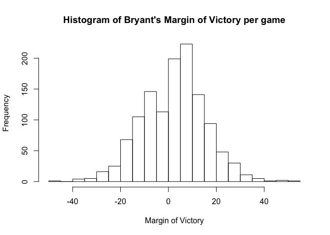
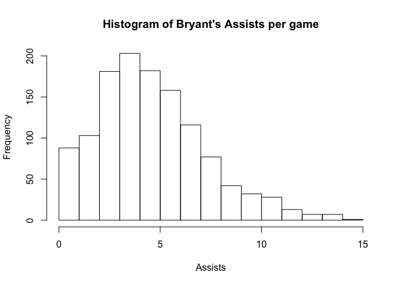
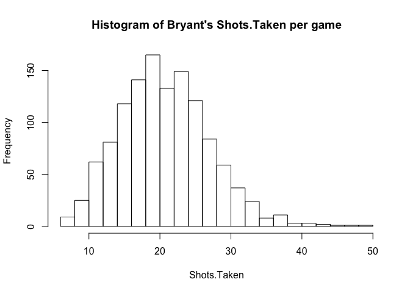
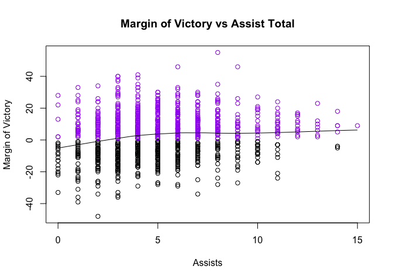
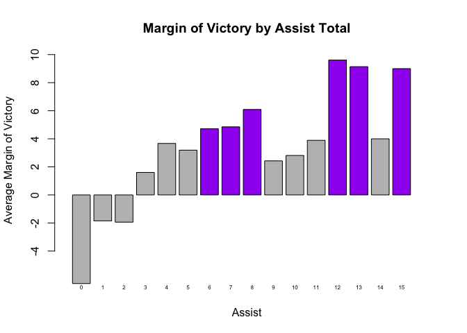
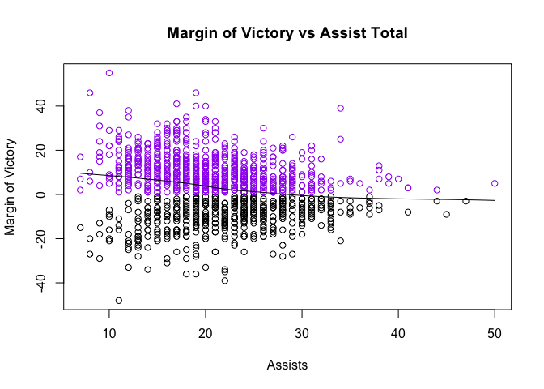
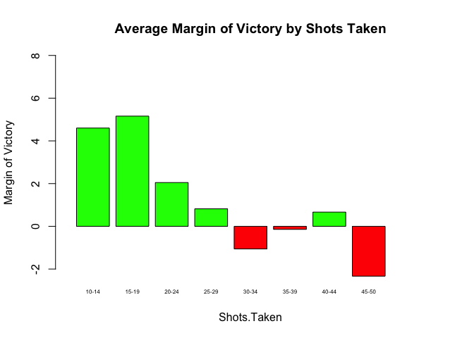
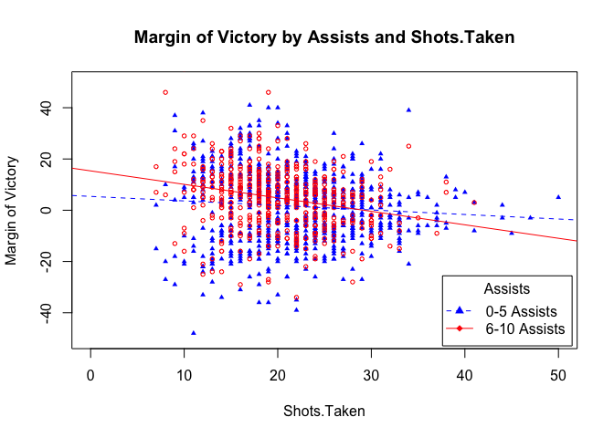

To Pass or Not To Pass: The Tale of Kobe Bryant
================

Kobe Bryant is a retired NBA legend who has had one of the most decorated careers of all time. However, sports pundits have criticized Bryant of taking too many shots and not passing the ball enough. The goal of this study is to discern a relationship, if any, between Kobe Bryant’s ball dominant play style and the team’s margin of victory.

My sample of 1238 games comes from all the games Kobe has played with the exception of games from the 96'-98' season and games Kobe left early due to injury. Kobe was not a key part of the team during his first couple years in the league so these statistics, along with the incomplete games, would not help in understanding if his ball dominant play style was beneficial or not. The source of this data comes from a verified basketball statistics website: BasketballReference.com. The response variable is margin of victory (in points) of the game Kobe played. The two explanatory variables are the amount of assists Kobe attained and the amount of shots Kobe took per game. The csv used in this project is in the current working directory and is called "kobe.csv"

``` r
# Load Packages
knitr::opts_chunk$set(echo = TRUE)
library(car)
library(ggplot2)
```

``` r
# Upload Data
kobe <- read.csv("kobe.csv", stringsAsFactors = FALSE)

# Histogram of Bryant's Margin of Victory per game"
hist(kobe$Margin, n=30, xlab = "Margin of Victory", 
     main = "Histogram of Bryant's Margin of Victory per game")
```



``` r
# Mean and SD
paste("Mean:",round(mean(kobe$Margin), digits = 3),"SD:",round(sd(kobe$Margin), digits = 3))
```

    ## [1] "Mean: 2.794 SD: 13.204"

The distribution of the response variable (margin of victory per game), follows an approximately normal distribution so there was no need for a transformation. Since the distribution is normal roughly symmetric, we will use the mean of ~2.8 points and the standard deviation of ~13 points as the appropriate statistics to describe the distribution.

``` r
# Histogram of Bryant's Assists per game
hist(kobe$Assists,xlab = "Assists",  
     main = "Histogram of Bryant's Assists per game") 
```



``` r
# Median and IQR
paste("Median:",round(median(kobe$Assists), digits = 3),"IQR:",round(IQR(kobe$Assists), digits = 3))
```

    ## [1] "Median: 5 IQR: 4"

The marginal distribution of the first explanatory variable, assists Kobe had per game, followed a normal distribution that was skewed right. The statistics used to describe this distribution is a median of 5 assists and an IQR of 4 assists.

``` r
# Histogram of Bryant's Shots.Taken per game
hist(kobe$Shots.Taken, n=30, xlab = "Shots.Taken", 
     main = "Histogram of Bryant's Shots.Taken per game")
```



``` r
# Mean and SD
paste("Mean:",round(mean(kobe$Shots.Taken), digits = 3),"SD:",round(sd(kobe$Shots.Taken), digits = 3))
```

    ## [1] "Mean: 21.211 SD: 6.325"

The marginal distribution of the second explanatory variable, shots taken by Kobe a game, followed a symmetric and normal distribution. The descriptive statistics used to describe this distribution is a mean of 21.01 shots and a standard deviation of 6.39 shots.

``` r
scatter.smooth(kobe$Assists, kobe$Margin,
               main = "Margin of Victory vs Assist Total",
               evaluation = 50,
               xlab = "Assists", ylab = "Margin of Victory", 
               col=ifelse(kobe$Margin>0,"purple","black"))
```



``` r
cor(kobe$Assists, kobe$Margin)
```

    ## [1] 0.1527202

There does seem to be a slight relationship between the Bryant's assists and margin of victory. The purple circles represent a margin of victory that is greater than zero and the black circles represent a margin of victory that is less than zero. After seeing a correlation of .15 between assists and margin of victory, we can conclude that increased assists had a marginal effect on the margin of victory.

``` r
zero_assist <- kobe[kobe$Assists == 0,]
zero <- sum(zero_assist$Margin)/ nrow(zero_assist)

one_assist <- kobe[kobe$Assists == 1,]
one <- sum(one_assist$Margin)/ nrow(one_assist)

two_assist <- kobe[kobe$Assists == 2,]
two <- sum(two_assist$Margin)/ nrow(two_assist)

three_assist <- kobe[kobe$Assists == 3,]
three <- sum(three_assist$Margin)/ nrow(three_assist)

four_assist <- kobe[kobe$Assists == 4,]
four <- sum(four_assist$Margin)/ nrow(four_assist)

five_assist <- kobe[kobe$Assists == 5,]
five <- sum(five_assist$Margin)/ nrow(five_assist)

six_assist <- kobe[kobe$Assists == 6,]
six <- sum(six_assist$Margin)/ nrow(six_assist)

seven_assist <- kobe[kobe$Assists == 7,]
seven <- sum(seven_assist$Margin)/ nrow(seven_assist)

eight_assist <- kobe[kobe$Assists == 8,]
eight <- sum(eight_assist$Margin)/ nrow(eight_assist)

nine_assist <- kobe[kobe$Assists == 9,]
nine <- sum(nine_assist$Margin)/ nrow(nine_assist)

ten_assist <- kobe[kobe$Assists == 10,]
ten <- sum(ten_assist$Margin)/ nrow(ten_assist)

eleven_assist <- kobe[kobe$Assists == 11,]
eleven <- sum(eleven_assist$Margin)/ nrow(eleven_assist)

twelve_assist <- kobe[kobe$Assists == 12,]
twelve <- sum(twelve_assist$Margin)/ nrow(twelve_assist)

thirteen_assist <- kobe[kobe$Assists == 13,]
thirteen <- sum(thirteen_assist$Margin)/ nrow(thirteen_assist)

fourteen_assist <- kobe[kobe$Assists == 14,]
fourteen <- sum(fourteen_assist$Margin)/ nrow(fourteen_assist)

fifteen_assist <- kobe[kobe$Assists == 15,]
fifteen <- sum(fifteen_assist$Margin)/ nrow(fifteen_assist)

B <- c(zero, one, two, three, four, five, six, seven, eight,
       nine, ten, eleven, twelve, thirteen, fourteen, fifteen)

barplot(B, main = "Margin of Victory by Assist Total",
        xlab = "Assist", ylab = "Average Margin of Victory",
        ylim=c(-5,10), xlim = c(0,20)
        , names.arg=c("0","1","2","3","4","5","6",
                       "7","8","9","10","11","12","13",
                       "14", "15"), cex.names=.5, col=ifelse(B>4,"purple","grey"))
```

 Although there is a rather weak correlation between assists and margin of victory, we can still explore varying levels of assists. In the bar plot above, bars shaded purple represent and average margin of victory greater than 4 by assist. It looks like Bryant enjoyed the greatest margin of victory in games where he had between 6-8 assists.

``` r
scatter.smooth(kobe$Shots.Taken, kobe$Margin,
               main = "Margin of Victory vs Assist Total",
               evaluation = 50,
               xlab = "Assists", ylab = "Margin of Victory", 
               col=ifelse(kobe$Margin>0,"purple","black"))
```



``` r
cor(kobe$Shots.Taken, kobe$Margin)
```

    ## [1] -0.1534914

Similarly to our previous comparison, there does seem to be a slight relationship between the Bryant's shots taken and margin of victory. The purple circles represent a margin of victory that is greater than zero and the black circles represent a margin of victory that is less than zero. After seeing a correlation of -.15 between shots taken and margin of victory, we can also conclude that increased shots taken had a marginal effect on the margin of victory.

``` r
# Average Margin of Victory By Shots Taken
shots_10_14 <- kobe[kobe$`Shots.Taken` >= 10 & kobe$`Shots.Taken` <= 14 ,]
marg_shots_10_14 <- sum(shots_10_14$Margin)/ nrow(shots_10_14)

shots_15_19 <- kobe[kobe$`Shots.Taken` >= 15 & kobe$`Shots.Taken` <= 19 ,]
marg_shots_15_19 <- sum(shots_15_19$Margin)/ nrow(shots_15_19)

shots_20_24 <- kobe[kobe$`Shots.Taken` >= 20 & kobe$`Shots.Taken` <= 24 ,]
marg_shots_20_24 <- sum(shots_20_24$Margin)/ nrow(shots_20_24)

shots_25_29 <- kobe[kobe$`Shots.Taken` >= 25 & kobe$`Shots.Taken` <= 29 ,]
marg_shots_25_29 <- sum(shots_25_29$Margin)/ nrow(shots_25_29)

shots_30_34 <- kobe[kobe$`Shots.Taken` >= 30 & kobe$`Shots.Taken` <= 34 ,]
marg_shots_30_34 <- sum(shots_30_34$Margin)/ nrow(shots_30_34)

shots_35_39 <- kobe[kobe$`Shots.Taken` >= 35 & kobe$`Shots.Taken` <= 39 ,]
marg_shots_35_39 <- sum(shots_35_39$Margin)/ nrow(shots_35_39)

shots_40_44 <- kobe[kobe$`Shots.Taken` >= 40 & kobe$`Shots.Taken` <= 44 ,]
marg_shots_40_44 <- sum(shots_40_44$Margin)/ nrow(shots_40_44)

shots_45_50 <- kobe[kobe$`Shots.Taken` >= 45 & kobe$`Shots.Taken` <= 50 ,]
marg_shots_45_50 <- sum(shots_45_50$Margin)/ nrow(shots_45_50)

C <- c(marg_shots_10_14, 
       marg_shots_15_19, marg_shots_20_24, marg_shots_25_29,
       marg_shots_30_34, marg_shots_35_39, marg_shots_40_44,
       marg_shots_45_50)

barplot(C, main = "Average Margin of Victory by Shots Taken",
        xlab = "Shots.Taken", ylab = "Margin of Victory",
        ylim=c(-2,8), xlim = c(0,11),
        names.arg=c("10-14", "15-19", "20-24",
                    "25-29", "30-34", "35-39", "40-44", "45-50"),
        cex.names=.5, col=ifelse(C>0,"green","red"))
```

 Despite a low correlation between shots taken and margin of victory, we can still assess how the team faired by specific shooting output. In this barchart, bars in green represent a positve margin of victory while red bars represent a negative margin of victory. Furthermore, I decided to exclude games where bryant shot less than 10 shots. This is due to the scarcity of data for less than 10 shots taken. From this visualization, Bryant experienced a significant margin of victory when he shot between 10-19 shots. Furthermore, the range of 15-19 shots taken had the greatest margin of victory which was roughly 5. This chart also shows a tapering off in margin of victory as Bryant attempts more than 20 shots.

``` r
#GLM With Center
kobe$`Shots.Taken Centered` <- kobe$`Shots.Taken`-mean(kobe$`Shots.Taken`)
kobe$Assists_c <- kobe$Assists - mean(kobe$Assists)


myglm <- lm(kobe$Margin ~ kobe$Assists_c*kobe$`Shots.Taken Centered`)
summary(myglm)
```

    ## 
    ## Call:
    ## lm(formula = kobe$Margin ~ kobe$Assists_c * kobe$`Shots.Taken Centered`)
    ## 
    ## Residuals:
    ##     Min      1Q  Median      3Q     Max 
    ## -50.014  -8.427   1.052   7.870  45.260 
    ## 
    ## Coefficients:
    ##                                            Estimate Std. Error t value
    ## (Intercept)                                 2.63862    0.37094   7.113
    ## kobe$Assists_c                              0.57766    0.13998   4.127
    ## kobe$`Shots.Taken Centered`                -0.30201    0.05921  -5.101
    ## kobe$Assists_c:kobe$`Shots.Taken Centered` -0.06165    0.02194  -2.809
    ##                                            Pr(>|t|)    
    ## (Intercept)                                1.91e-12 ***
    ## kobe$Assists_c                             3.93e-05 ***
    ## kobe$`Shots.Taken Centered`                3.92e-07 ***
    ## kobe$Assists_c:kobe$`Shots.Taken Centered`  0.00504 ** 
    ## ---
    ## Signif. codes:  0 '***' 0.001 '**' 0.01 '*' 0.05 '.' 0.1 ' ' 1
    ## 
    ## Residual standard error: 12.91 on 1234 degrees of freedom
    ## Multiple R-squared:  0.04694,    Adjusted R-squared:  0.04462 
    ## F-statistic: 20.26 on 3 and 1234 DF,  p-value: 8.093e-13

``` r
low.assists <- kobe[kobe$Assists<= 5,]
high.assists <- kobe[kobe$Assists > 5 & kobe$Assists > 5,]

plot(low.assists$`Shots.Taken`, low.assists$Margin , main = "Margin of Victory by Assists and Shots.Taken",
     xlab = "Shots.Taken", ylab = "Margin of Victory",
     xlim = c(0,50), ylim = c(-50,50),
     cex = 0.6, col = "blue", pch = 17)
points(high.assists$`Shots.Taken`, high.assists$Margin, col = "red", 
       cex = 0.6)

abline(lm(low.assists$Margin~low.assists$`Shots.Taken`),col = "blue", lty = 2)
abline(lm(high.assists$Margin~high.assists$`Shots.Taken`), col = "red")

legend("bottomright", title = "Assists", c("0-5 Assists", "6-10 Assists"), 
       col = c("blue", "red"), pch = c(17, 18), lty = c(2, 1), inset = 0.01)
```

 From our general linear model, the two explanatory variables (assists and shots taken) were significant in predicting margin of victory. However, an R squared of 4% raises some red flags. This small R squared implies that there are other factors that play a role in the margin of victory. After all, basketball is a team sport. Looking at purely 2 variables of one player does not tell the whole story. Despite this, our analysis on margin of victory by levels of assists and shots taken implies that Bryant experienced a higher margin of victory when he took 15-20 shots and attained 6-8 assists. Furthermore, there does seem to be an intereaction between assists and shots taken. This makes sense because in games where Bryant takes too many shots, his assists are bound to be lower. A confounding variable could be the presence or lack of better teammates. Kobe had a higher win percentage when he played with Hall of Fame players Shaquille O' Neal and Pau Gasol and a lower win percentage without them which affects the response variable: margin of victory. Future research efforts will aim to find the other explanatory variables that justify variation in margin of victory and take into account periods where Bryant played with better teammates. Bottom Line: looking at soley Bryant's assists and shots taken a game does not accuratley assess if his ball dominat play style hurt the Lakers. However, the team averaged the highest average margin of victory when he had 6-8 assists and attempted 15-19 shots per game.
